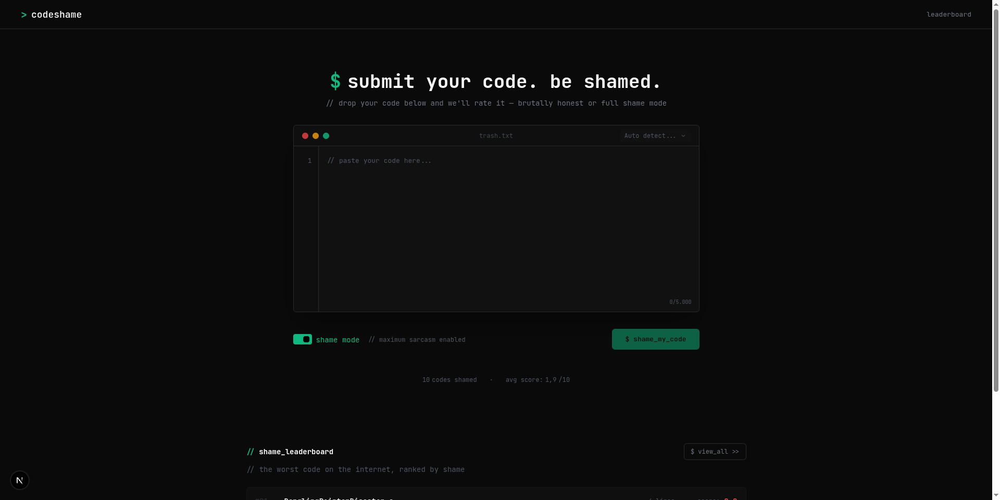
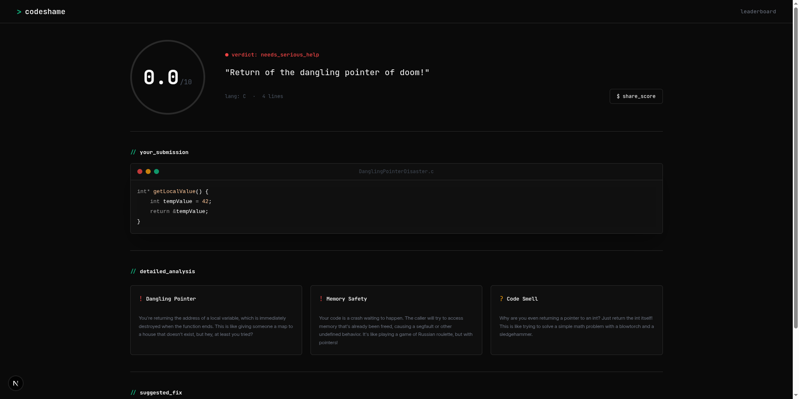

# CodeShame

CodeShame is an interactive code review app that scores messy code, points out its worst problems, and turns the whole experience into something playful and shareable.

This fork is maintained by **Cesarino Jr**.



## What It Does

- Analyze pasted code with AI-generated feedback
- Switch between public `shame mode` and private `honest mode`
- Detect the submitted language automatically
- Show a score, short verdict, three main issues, and a suggested fix
- Publish public roasts to a global leaderboard
- Generate shareable result pages and Open Graph images



## Tech Stack

- [Next.js](https://nextjs.org/) with App Router
- [React 19](https://react.dev/)
- [Tailwind CSS v4](https://tailwindcss.com/)
- [tRPC](https://trpc.io/)
- [PostgreSQL](https://www.postgresql.org/) + [Drizzle ORM](https://orm.drizzle.team/)
- [Vercel AI SDK](https://sdk.vercel.ai/)

## Local Setup

1. Clone the repository:

   ```bash
   git clone https://github.com/CesarinoNhabangue/CodeShame
   cd CodeShame
   ```

2. Install dependencies:

   ```bash
   pnpm install
   ```

   On Windows PowerShell, if `pnpm` is blocked by `ExecutionPolicy`, use:

   ```bash
   pnpm.cmd install
   ```

3. Start the database with Docker:

   ```bash
   docker compose up -d
   ```

4. Create your environment file:

   ```bash
   cp .env.example .env
   ```

5. Set your environment variables:

- `DATABASE_URL` for your local or hosted PostgreSQL database
- `GROQ_API_KEY` for Groq

If you prefer OpenAI instead of Groq, update the backend provider accordingly.

6. Run database setup:

   ```bash
   pnpm run db:push
   pnpm run db:seed
   ```

   On Windows PowerShell, if needed:

   ```bash
   pnpm.cmd run db:push
   pnpm.cmd run db:seed
   ```

7. Start the development server:

   ```bash
   pnpm run dev
   ```

   On Windows PowerShell, if needed:

   ```bash
   pnpm.cmd run dev
   ```

8. Open:

   ```txt
   http://localhost:3000
   ```

## Deploy

The project is built with Next.js, so Vercel is the most direct deployment option. Since Vercel is serverless, you should use a hosted PostgreSQL database instead of local Docker Compose.

### Recommended Setup

- Use Vercel Postgres or Neon for `DATABASE_URL`
- Add `GROQ_API_KEY` in your Vercel project environment variables
- Run the database setup commands against the production database before using the app

```bash
pnpm run db:push
pnpm run db:seed
```

On Windows PowerShell, if needed:

```bash
pnpm.cmd run db:push
pnpm.cmd run db:seed
```

## Notes

- Public submissions appear on the leaderboard
- Private submissions stay out of the leaderboard
- The app currently depends on external font download during build through `next/font`
